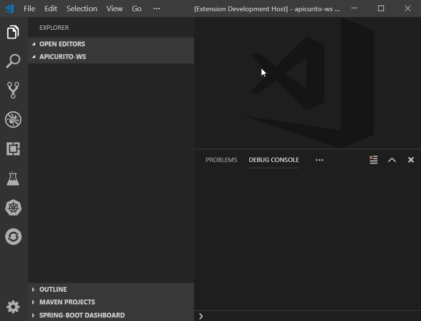

# Message Minder — A Webview API Sample

Demonstrates VS Code's [webview API](https://code.visualstudio.com/api/extension-guides/webview). This includes:

- Creating and showing a basic webview.
- Dynamically updating a webview's content.
- Loading local content in a webview.
- Running scripts in a webview.
- Sending message from an extension to a webview.
- Sending messages from a webview to an extension.
- Using a basic content security policy.
- Webview lifecycle and handling dispose.
- Saving and restoring state when the panel goes into the background.
- Serialization and persistence across VS Code reboots.

This was based on the [webview sample](https://github.com/Microsoft/vscode-extension-samples/tree/master/webview-sample) from Microsoft. The project was started by Paolo Antinori and updated by Brian Fitzpatrick.

## Demo

## VS Code API

### `vscode` module

- [`window.createWebviewPanel`](https://code.visualstudio.com/api/references/vscode-api#window.createWebviewPanel)
- [`window.registerWebviewPanelSerializer`](https://code.visualstudio.com/api/references/vscode-api#window.registerWebviewPanelSerializer)

## Running the example

- Open this example in VS Code 1.25+
- `npm install`
- `npm run watch` or `npm run compile`
- `F5` to start debugging

Run the `Message Minder: Start message minder session` to create the webview.

In the field, type some text and click 'Send'. An informational dialog will appear with the text you sent from the webview back to vscode.

Once that is running, run the `Message Minder: Send message to running message minder session` to send a message from vscode to the Message area text area control in the webview.